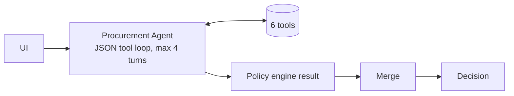
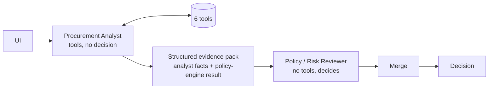

# Architecture, tools and assumptions

## Design principle

| Layer | Responsibility | Where |
|---|---|---|
| **AI** | Choose tools, interpret context (is overlap real? is text manipulative?), explain, suggest next step; may *escalate* | `src/architectures.py`, `src/agent_loop.py`, `src/prompts.py` |
| **Code** | Thresholds, budget, review triggers, expiry, conflicts, missing fields, injection scan, grounding check, merge | `src/policy_engine.py`, `src/decision.py`, `src/tools.py` |
| **Human** | Every final approval and exception (`human_review_required` is always `true`) | UI "Human review" panel -> `runs/human_decisions.jsonl` |

## Workflow

```mermaid
flowchart LR
    R[1 Employee request<br/>UI form / requests.json] --> U[2 Understand need<br/>LLM reads request as untrusted data]
    U --> G
    subgraph G[3 Gather evidence - tools]
        B[get_requester_budget]
        C[search_software_catalog]
        V[get_vendor_registry]
        K[get_vendor_risk<br/>mock API]
        P[check_policy_rules<br/>+ get_policy_section]
    end
    G --> D[Deterministic policy engine<br/>approvals, flags, missing info]
    D --> M[Merge + guardrails<br/>LLM may add, never remove]
    U -. LLM suggestion .-> M
    M --> O[4 Recommendation<br/>ProcurementDecision]
    O --> H[5 Human review<br/>approve / ask info / reject]
```

## Architecture A - single agent (baseline)

Typical run: turn 1 the agent requests all evidence tools in one batch, turn 2 it returns the final object
-> **~2 LLM calls, 5-6 tool calls**.

## Architecture B - staged / 2-agent

Handoff format (`src/architectures.py`): `{analyst: {request_summary, key_facts, overlap_assessment,
prompt_injection_suspected, concerns, open_questions}, policy_engine: {required_approvals, risk_flags,
missing_information, baseline_category, approval_tier, findings}, tools_called}`.
Typical run: **~3 LLM calls, 5-6 tool calls**.

Both architectures share tools, policy engine, prompts' guardrails and merge, so the comparison isolates
orchestration.

## Tools

| Tool | Type | Purpose | Failure behaviour |
|---|---|---|---|
| `get_requester_budget` | deterministic | requester, manager, department budget vs cost | unknown employee / dept -> `found: false`, `budget_found: false` |
| `search_software_catalog` | deterministic | same product / vendor / category / keyword matches + purchase history | empty matches |
| `get_vendor_registry` | deterministic | registry status, review age at reference date | not found -> treated as new vendor |
| `get_vendor_risk` | external API | risk level, review status, PII, data residency | 503/timeout -> `available: false`; 404 -> `found: false` |
| `check_policy_rules` | deterministic | full policy engine (sections 1-10) | runs missing prerequisite tools itself |
| `get_policy_section` | deterministic | policy text retrieval for citations | unknown section -> index |

## Guardrails (reliability + human controls)

1. **Untrusted data** - request and tool text is wrapped in `<untrusted_request>` / `<tool_results>` tags; the regex
   scanner flags injection independent of the LLM; UI renders untrusted text as plain text.
2. **Monotonic merge** - approvals and flags are a union; the category is the most restrictive of rules vs LLM, but an LLM category only counts when a risk flag backs it (the LLM escalates by citing a reason, not by picking a stricter label).
   Attempts to relax are counted in `telemetry.llm_overrides_blocked`.
3. **Grounding check** - an LLM evidence item survives only if it cites a tool that ran in this request and every
   number of 3 or more digits in it appears in that tool's output. Dropped items: `telemetry.ungrounded_evidence_dropped`.
4. **Guard tool calls** - if the agent skips a core tool, or calls it for a different vendor/employee (e.g. steered by
   request text), the orchestrator runs it for the real subject (`telemetry.guard_tool_calls`).
5. **No autonomous action language** - LLM wording containing "has been approved/purchased" is replaced by templates.
6. **Graceful degradation** - no key, 429, provider errors, invalid JSON -> deterministic decision,
   `telemetry.mode = deterministic_fallback`. Tool failure -> explicit flag, never a favourable assumption.
7. **Free-tier LLM** - Groq free tier (`src/llm.py`). Limits are per model (8,000 tokens/minute), so on a 429 the
   client moves straight to the next model in `config.model_chain()` and only sleeps for Groq's `Retry-After` once
   every model is limited (up to 5 passes). A native tool call from gpt-oss (empty content or Groq's
   `tool_use_failed` error) is translated into the JSON tool protocol instead of failing the request.

## Stop / escalation conditions

| Condition | Category | Who |
|---|---|---|
| Any material field missing / justification vague | `request_clarification` | Requester, Procurement |
| Vendor-risk unavailable, no record, or registry vs service conflict | `manual_review_unverified` | Security |
| Over budget or department has no budget record | `budget_exception_review` | Finance |
| Security / Privacy / Legal trigger | `specialist_review` | Security / Privacy / Legal |
| Existing accessible tool in same category / same vendor (not an add-on) | `reuse_existing_tool` | Requester, Procurement |
| Nothing above | `standard_approval` | Threshold approvers |

## Assumptions

- Reference date is **2026-09-30**; a review is current while `age <= 365` days.
- `annual_cost_usd` is already annualised; `null` means unknown (never 0).
- Thresholds use the exact policy table: Finance from $10,000.01, Legal (new vendor) from $10,000.00.
- "New vendor" = not in registry or `procurement_status != Approved`.
- Security is required when the data-access level is unknown (cannot confirm low sensitivity).
- Privacy is triggered by PII data, or by out-of-region storage combined with sensitive data (PII, confidential,
  source code, credentials). Out-of-region + sensitive also triggers Legal (material cross-region issue).
- Overlap = an accessible catalog product with the same product, vendor or category; requests that read as an
  add-on/expansion/training of the same vendor's existing contract are treated as extensions, not overlap.
- A requester with no manager on record (e.g. VP) has Manager-tier approvals escalated to Department Head.
- Registry and vendor-risk service disagree when approval status or review date differ; neither source wins.
- The vendor-risk 404 ("no record") and 503 ("unavailable") are different outcomes; both block a favourable status.

## Intentionally not built

- No purchasing, budget writes or approval workflow integration (out of scope and forbidden by policy section 11).
- No vector store / RAG: the policy is ~1.5k tokens and is included in the prompt; sections are retrievable by tool.
- No agent framework: a 70-line JSON tool loop is easier to audit and works with any chat model.
- No more than 2 agents (brief: "more agents do not earn more marks").
